# API Health & Incident Monitoring — Entity Relationship Diagram

Matches `schema.sql` exactly — 15 tables across 5 groups: **Access & people**,
**Monitoring core**, **Problems**, **Alerting**, **Reporting / audit / AI**.

```mermaid
erDiagram
    users ||--o{ team_memberships : "joins teams"
    teams ||--o{ team_memberships : "has members"
    teams ||--o{ monitors : owns
    teams ||--o{ notification_channels : owns
    teams ||--o{ reports : has
    monitors ||--o{ monitor_assertions : "has rules"
    monitors ||--o{ health_check_results : "is checked"
    monitors ||--o{ health_check_daily_rollups : summarised
    monitors ||--o{ incidents : "has problems"
    monitors ||--o{ maintenance_windows : "has maintenance"
    monitors |o--o{ notification_channels : "scoped to (optional)"
    monitors |o--o{ reports : "about (optional)"
    monitor_assertions |o--o{ health_check_results : "failed assertion"
    incidents ||--o{ alert_deliveries : triggers
    notification_channels ||--o{ alert_deliveries : "sent via"
    incidents ||--o{ ai_analyses : "analysed by"
    ai_analyses ||..o{ embeddings : "vectorised (logical link)"
    users ||--o{ audit_entries : performs
    users ||--o{ maintenance_windows : creates
    users ||--o{ reports : requests

    users {
        uuid id PK
        citext email UK
        varchar full_name
        text password_hash
        boolean is_active
        timestamptz created_at
        timestamptz updated_at
    }

    teams {
        uuid id PK
        varchar name
        timestamptz deleted_at "soft delete"
        timestamptz created_at
        timestamptz updated_at
    }

    team_memberships {
        uuid id PK
        uuid team_id FK
        uuid user_id FK
        enum role "team_role: admin, operator, read_only"
        timestamptz created_at
    }

    monitors {
        uuid id PK
        uuid team_id FK
        varchar name
        text url
        enum method "http_method"
        boolean enabled
        int check_interval_seconds
        int current_interval_seconds
        int timeout_seconds
        int failure_threshold
        int recovery_threshold
        int consecutive_failures
        int consecutive_successes
        timestamptz backoff_until
        int expected_status_code
        varchar user_agent
        timestamptz next_check_at
        timestamptz deleted_at "soft delete"
        timestamptz created_at
        timestamptz updated_at
    }

    monitor_assertions {
        uuid id PK
        uuid monitor_id FK
        enum assertion_type "text_contains, regex, jsonpath"
        text expression
        text expected_value
        boolean enabled
        timestamptz created_at
        timestamptz updated_at
    }

    health_check_results {
        uuid id PK "composite PK with checked_at"
        uuid monitor_id FK
        timestamptz checked_at PK "partition key, monthly"
        enum status "check_status: healthy, failing, degraded"
        int http_status_code
        int response_time_ms
        boolean timeout
        boolean connection_error
        boolean ssl_error
        uuid failed_assertion_id FK
        text error_message
        text response_body_excerpt
        timestamptz created_at
    }

    health_check_daily_rollups {
        uuid id PK
        uuid monitor_id FK
        date day
        int total_checks
        int failed_checks
        numeric avg_response_time_ms
        numeric p95_response_time_ms
        numeric uptime_percentage
        timestamptz created_at
    }

    incidents {
        uuid id PK
        uuid monitor_id FK
        enum status "incident_status: open, resolved"
        timestamptz opened_at
        timestamptz resolved_at
        int failure_count
        int recovery_count
    }

    notification_channels {
        uuid id PK
        uuid team_id FK
        uuid monitor_id FK "nullable, NULL = whole team"
        enum type "channel_type: email, slack, discord, webhook"
        varchar name
        boolean is_enabled
        jsonb configuration
        text secret_ref
        timestamptz created_at
        timestamptz updated_at
    }

    alert_deliveries {
        uuid id PK
        uuid incident_id FK
        uuid notification_channel_id FK
        enum status "delivery_status: pending, sent, failed"
        int attempt_count
        timestamptz sent_at
        text error_message
    }

    maintenance_windows {
        uuid id PK
        uuid monitor_id FK
        varchar name
        timestamptz starts_at
        timestamptz ends_at
        enum mode "maintenance_mode: suppress_alerts, pause_monitoring"
        text reason
        uuid created_by FK
        timestamptz created_at
        timestamptz updated_at
    }

    reports {
        uuid id PK
        uuid team_id FK
        uuid monitor_id FK "nullable"
        uuid requested_by FK
        timestamptz period_start
        timestamptz period_end
        numeric uptime_percentage
        int total_checks
        int failed_checks
        int total_downtime_seconds
        timestamptz created_at
    }

    audit_entries {
        uuid id PK
        uuid user_id FK
        enum action "audit_action: INSERT, UPDATE, DELETE"
        varchar entity_type
        uuid entity_id "logical reference, polymorphic"
        jsonb old_values
        jsonb new_values
        timestamptz created_at
    }

    ai_analyses {
        uuid id PK
        uuid incident_id FK
        text summary
        jsonb suggested_actions
        varchar model
        timestamptz created_at
    }

    embeddings {
        uuid id PK
        varchar entity_type
        uuid entity_id "logical reference to ai_analyses"
        text content
        vector embedding "pgvector(1536)"
        timestamptz created_at
    }
```



## Reading the connection-line signs

| Symbol | Meaning |
|---|---|
| `\|\|` | Exactly one (mandatory, single parent) |
| `\|o` | Zero or one (optional, at most one) |
| `\|{` | One or many (at least one child) |
| `o{` | Zero or many (children optional) |
| `--` solid line | Real foreign-key relationship |
| `..` dashed line | Logical link only (no real FK — e.g. `ai_analyses` → `embeddings`, linked via `entity_type`/`entity_id`, not a hard FK, since `embeddings` is polymorphic) |

## The five tables to learn first

```
monitors → health_check_results → incidents → alert_deliveries → notification_channels
```

Everything else (users, teams, assertions, maintenance, rollups, reports, audit, AI) supports these five.
